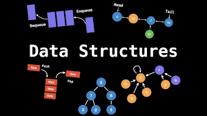

# 🚀 Code Guru – AI-Powered Learning Platform

Welcome to **Code Guru** – a self-paced learning platform designed to make education smarter and more interactive. This project is built for students who want to learn independently and for teachers who want to contribute their own learning materials. 

It includes features like an **AI chatbot** to clear doubts, **quizzes** to test knowledge, and **study areas** filled with valuable learning content. Teachers can also submit their own courses to help others grow.



---

## 🌟 What’s Inside

- 🤖 **AI Chatbot** to answer programming and concept-related queries.
- 📚 **Study Materials** organized for easy access and learning at your own pace.
- 🧠 **Quizzes** for practice and revision.
- 📤 **Teacher Course Submission** section so educators can contribute.
- 🛠️ **Extras** like surveys, sign-in pages, and a neat user interface.

---

## 📁 Project Structure

Here's what you’ll find in this repository:

CODEGURU25/
├── index.html # Homepage of the platform
├── Sign.html # Login / sign-in page
├── studyarea.html # Main study zone
├── study2.html # Extra study resources
├── quiz_study.html # Quiz section
├── survey.html # User survey form
├── demox.html # Chatbot interface (demo)
├── package.json # For future Node.js dependencies 

---

## 🌐 View Live

The project is hosted on GitHub Pages:

🔗 [Click to view Code Guru](https://sanatkrv9555.github.io/CODEGURU25)

---

## 🧰 Technologies Used

- **HTML5** – for structuring the website  
- **CSS3** – for styling the pages  
- **JavaScript (Vanilla)** – for interactivity and logic  
- **GitHub Pages** – for hosting and deployment

---

## 🧪 How to Use This Project

Want to test or modify it on your local machine?

1. Open your terminal
2. Clone the repository:
   ```bash
   git clone https://github.com/sanatkrv9555/CODEGURU25.git
Open index.html in your browser to start exploring.

🙋 Author
Sanat Kumar Verma
B.Tech CSE (2022–2026)
📧 Email: csefw2203@glbitm.ac.in
🌐 GitHub: @sanatkrv9555


